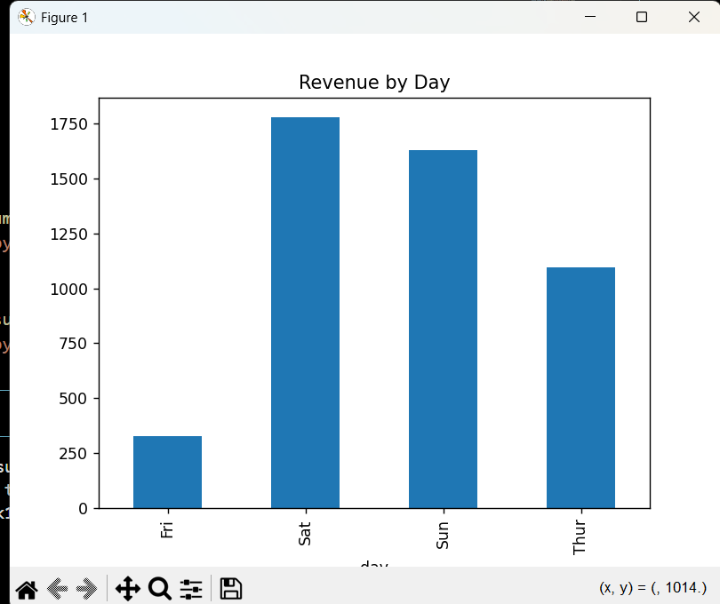
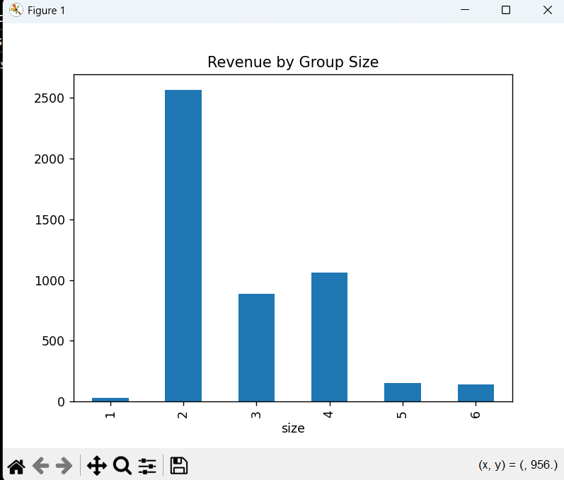
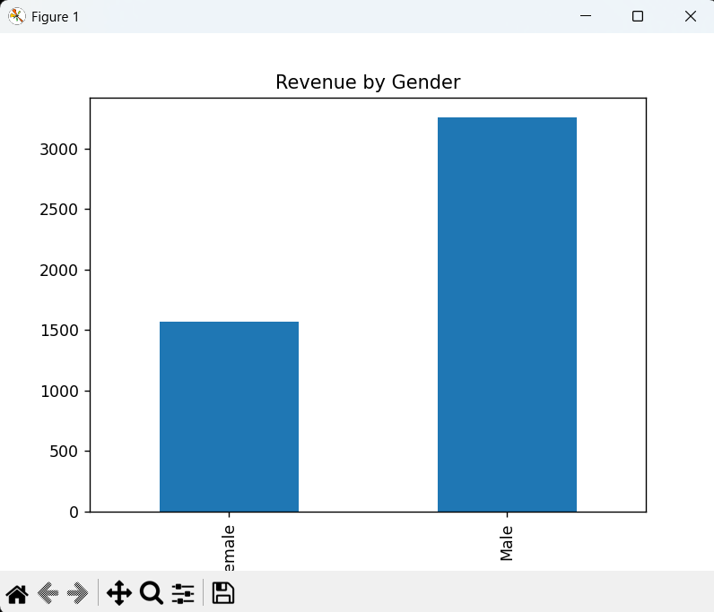

# Sales Data Analysis (Task 1)

## Tools Used
- Python
- Pandas
- Matplotlib

## Objective
Analyze sales data to identify revenue patterns.

## Steps
1. Loaded dataset using pandas
2. Created Revenue column
3. Grouped data by day, group size, and gender
4. Visualized using bar charts

## Key Insights
- Weekend days (Sat, Sun) generate highest revenue
- Larger group sizes spend more
- Gender-wise revenue shows slight variation

## Output

## Conclusion
Business should focus on weekends and group customers to increase revenue.